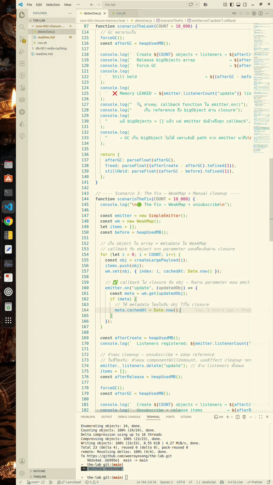

# core-002: Closure Memory Leak Detective 🧪

Status: [COMPLETED]  
Category: Core  
Tag: WeakMap, Garbage Collection  
Last Updated: กรกฎาคม 2026

## สมมติฐาน (Hypothesis)

Closure ใน JavaScript กัก reference ของ outer scope ทั้งหมด
แม้จะใช้แค่บางส่วน ทำให้ GC ไม่สามารถเก็บ object ใหญ่ๆ ได้
→ heap ค่อยๆ โตจน Single Page App crash หลังจากเปิด tab นานๆ

**_GC = Garbage Collection (การจัดการขยะในหน่วยความจำ(การคืนแรม))_**



```text
Closure คือ ฟังก์ชันที่ยังคงจดจำและเข้าถึงตัวแปรในขอบเขต (Scope) ของฟังก์ชันแม่ได้แม้ว่าฟังก์ชันแม่จะทำงานเสร็จและคืนค่าไปแล้วก็ตาม โดยมีประเด็นหลักคือ Closure, Memory Leak และความสัมพันธ์ระหว่างสองสิ่งนี้

Closure ใน JavaScript
ความหมาย: การที่ฟังก์ชันด้านใน (Inner Function) ผูกติดกับสภาพแวดล้อมและตัวแปรของฟังก์ชันด้านนอก (Outer Function)
ประโยชน์: ใช้ซ่อนข้อมูล (Data Privacy) หรือสร้างตัวแปรแบบ private ที่แก้ไขได้ผ่านฟังก์ชันที่กำหนดไว้เท่านั้น
ตัวอย่าง: ฟังก์ชันนับเลข (counter) ที่เก็บค่าตัวเลขไว้ข้างในและเพิ่มค่าทีละหนึ่งโดยที่ตัวแปรหลักถูกซ่อนไม่ให้คนอื่นแก้ตรงๆ

Memory Leak ใน JavaScript
ความหมาย: การที่โปรแกรมจองหน่วยความจำไว้ใช้งาน แต่ไม่ได้ใช้งานต่อแล้ว และระบบทำลายขยะอัตโนมัติ (Garbage Collector) ไม่สามารถลบออกได้เพราะยังมีตัวแปรอ้างอิงอยู่ ทำให้หน่วยความจำเต็มช้าๆ
สาเหตุที่พบบ่อย:การประกาศตัวแปร Global ทิ้งไว้โดยไม่ตั้งใจการตั้ง Timer (setInterval หรือ setTimeout) ค้างไว้การติด Event Listener บน DOM แล้วไม่ยอมถอดออก (removeEventListener)การใช้ Closure อย่างไม่ระมัดระวัง

ความสัมพันธ์ระหว่าง Closure กับ Memory Leak
ทำไมถึงรั่ว: เพราะ Closure จะเกาะติดและเก็บข้อมูลตัวแปรของฟังก์ชันนอกไว้ตลอดเวลา หากฟังก์ชันในถูกอ้างอิงไว้ตลอด หน่วยความจำของตัวแปรนั้นจะถูกแช่แข็งไว้และไม่ถูกเคลียร์ทิ้งวิธีป้องกัน: เคลียร์ค่าตัวแปรหรือยกเลิกการอ้างอิง (set เป็น null) เมื่อไม่ได้ใช้งานแล้ว หรือระวังการสร้างฟังก์ชันซ้อนกันในลูปหรือเหตุการณ์ที่เรียกซ้ำๆ
```

## 🔬 การทดลอง (Experiment Design)

### 3 Scenarios (แบ่ง 3 เฟส: ทดสอบ Closure ที่เฟส 2)

| #   | Scenario     | Pattern                                  | Expected           |
| --- | ------------ | ---------------------------------------- | ------------------ |
| 1   | **Baseline** | WeakMap + release refs                   | ✅ GC frees memory |
| 2   | **The Leak** | EventEmitter + Closure holding large obj | ❌ Memory leaked   |
| 3   | **The Fix**  | WeakMap + unsubscribe + param passing    | ✅ GC frees memory |

### เราจะวัดอะไร (What We Measure)

- `process.memoryUsage().heapUsed` (in MB)
- Before → After Create → After Release → After `global.gc()`

## 🚀 รัน Bash Command บน Terminal ดูผลลัพธ์เลย (Quick Start)

```bash
# Run once, see all 3 scenarios + summary table
bash run.sh

# Or directly
node --expose-gc detective.js
```

## 📊 ผลลัพธ์ (Sample Output)

```
╔══════════════════════════════════════════════════════════╗
║               📊 BENCHMARK SUMMARY                       ║
╠══════════════════════════════════════════════════════════╣
║ Scenario              │ Heap After GC │ Freed │ Leak?    ║
╟───────────────────────┼───────────────┼───────┼──────────╢
║ 📦 Baseline (WeakMap) │     4.5 MB    │ 10.0 MB │ ✅ NO  ║
║ 🔴 Closure Leak       │    45.5 MB    │  0.3 MB │ ❌ YES ║
║ 🟢 WeakMap + Cleanup  │     4.6 MB    │  9.9 MB │ ✅ NO  ║
╚══════════════════════════════════════════════════════════╝
```

## 🧠 หลักการทำงาน (How It Works)

### The Leak (Scenario 2)

```
emitter (global/long-lived)
  └─> _listeners Map
        └─> Set of callbacks
              └─> callback function
                    └─> [[Scope]] (closure)
                          └─> bigObject (1KB) ← TRAPPED!
```

แม้เราจะปล่อย `bigObjects = []` แล้ว แต่ emitter ยังมี path ไปถึงทุก bigObject ผ่าน closure ของ callback → GC เก็บไม่ได้

### The Fix (Scenario 3)

```
emitter
  └─> callback (รับ obj ผ่าน parameter — ไม่มี bigObject ใน closure)
        └─> WeakMap.get(obj) → metadata (weak ref — GC เก็บได้)
```

หลัง unsubscribe + release items → ไม่มี reference ใดเหลือ → GC เก็บทั้งหมด

## 🏢 Business Value — Production Impact

### Real Bug ที่เจอจริง

- **React SPA**: `useEffect` ที่ subscribe event bus แต่ลืม return cleanup function → เปิด tab 2-3 ชม. ใช้ RAM 1-2 GB แล้ว crash
- **Node.js WebSocket server**: client disconnect แต่ listener ใน global emitter ไม่เคยถูกลบ → memory leak สะสม → OOM kill ทุก 2 วัน
- **Real-time Dashboard**: เปิดทิ้งไว้ข้ามคืน → browser tab crash เพราะทุก data update เพิ่ม closure เข้า emitter

### ข้อควรระวังที่สำคัญ (Prevention Checklist)

- [x] ทุก `.on()` / `.addEventListener()` ต้องมี `.off()` / `.removeEventListener()` คู่กัน
- [x] ใน React: `useEffect` return cleanup function เสมอ
- [x] ใช้ WeakMap สำหรับ metadata ที่ผูกกับ object lifecycle
- [x] ส่งข้อมูลผ่าน function parameter แทนการอ้างอิงผ่าน closure
- [x] Profiling ด้วย Chrome DevTools Memory tab หรือ `node --inspect` เป็นระยะ

## 🔧 Tech Stack

- **Runtime**: Node.js 18+
- **Dependencies**: - (stdlib only)
- **Key APIs**: `process.memoryUsage()`, `global.gc()`, `WeakMap`, `Buffer.alloc()`

## 📝 Status

✅ Complete — All 3 phases done

---

## 👶 สรุปความเข้าใจอย่างง่าย (ELI5 — Explain Like I'm 5)

ลองนึกภาพว่าคุณมีของเล่น 🧸 และกล่องเก็บของเล่น 📦

**Closure ก็เหมือนการที่คุณเอาเชือกผูกของเล่นไว้กับตัวเอง**

- คุณมีตุ๊กตาหมีตัวใหญ่ 🧸
- คุณผูกเชือกจากตุ๊กตาไว้ที่ข้อมือคุณ
- แม้คุณจะวางตุ๊กตาลงบนพื้น (release reference)
- **แต่เชือกยังอยู่!** → คุณก็ยังลากตุ๊กตาไปไหนมาไหนด้วยอยู่ดี
- แม่ (Garbage Collector) จะมาเก็บของเล่นไปไม่ได้ เพราะเห็นว่าคุณยังมีเชือกผูกลากตุ๊กตาอยู่

**WeakMap ก็เหมือนกระดาษโพสต์อิท 📝**

- คุณแปะโน้ตบนตุ๊กตาหมี (metadata) โดยไม่ต้องผูกเชือก
- เมื่อคุณวางตุ๊กตาลงและเดินจากไป (release reference)
- แม่เห็นว่าตุ๊กตาไม่มีใครเล่นแล้ว → เก็บลงกล่องเก็บได้เลย
- โพสต์อิทก็หายไปพร้อมตุ๊กตา ไม่ทิ้งขยะไว้

### สิ่งที่เราเรียนรู้ (Lessons Learned)

1. **อย่าผูกเชือกถ้าไม่จำเป็น** — ใช้ WeakMap แทน closure สำหรับ metadata
2. **แกะเชือกทุกครั้งเมื่อเลิกเล่น** — unsubscribe event listener เสมอ
3. **ให้ของเล่นผ่านมือ** (parameter) — ดีกว่าให้เด็กวิ่งไปหยิบเอง (closure)

---

## 📚 References

- [MDN: Closures](https://developer.mozilla.org/en-US/docs/Web/JavaScript/Closures)
- [MDN: WeakMap](https://developer.mozilla.org/en-US/docs/Web/JavaScript/Reference/Global_Objects/WeakMap)
- [V8 Blog: Memory Management](https://v8.dev/blog)
- [Node.js: --expose-gc](https://nodejs.org/api/cli.html#--expose-gc)
