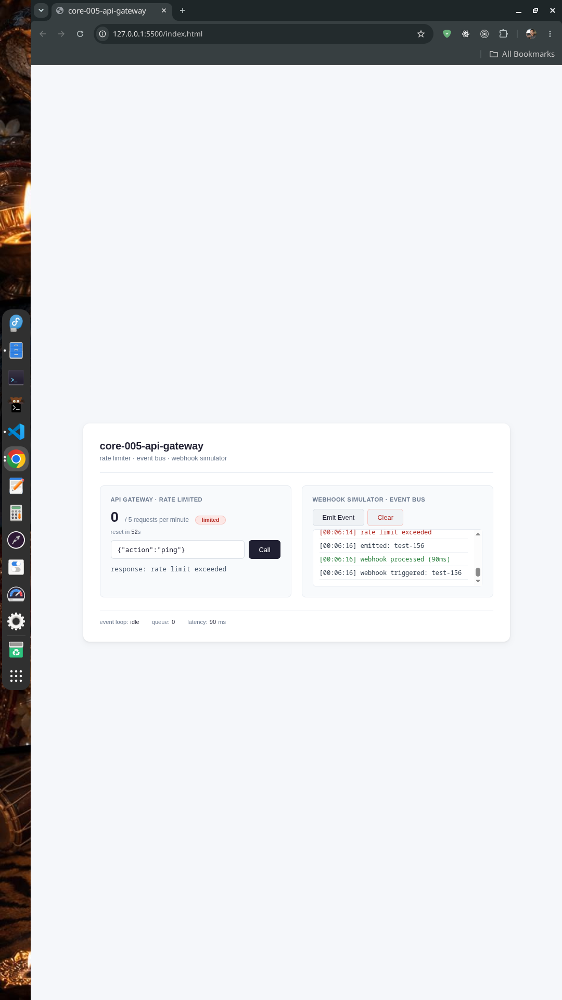

# core-005-api-gateway

**Status:** [COMPLETED]  
**Category:** API Gateway & Caching Pattern  
**Tags:** Performance, Architecture, Rate Limiting, Event Bus  
**Last Updated:** August 2026

โปรเจกต์นี้เป็นห้องปฏิบัติการ (Lab) สำหรับศึกษาและจำลองการทำงานของ API Gateway ที่มาพร้อมกับกลไกสำคัญสำหรับระบบ SaaS ได้แก่ Rate Limiting, Event Bus (Pub/Sub), และ Webhook Simulator เพื่อให้เข้าใจหลักการ Under the Hood ของระบบที่มีการเรียกใช้งาน API ในระดับ Production



---

## 🎯 วัตถุประสงค์ (Objectives)

- ✅ ศึกษาและ implement Rate Limiter แบบ Sliding Window สำหรับป้องกัน API Abuse
- ✅ สร้าง Event Bus (Pub/Sub Pattern) สำหรับการส่งต่อข้อมูลระหว่าง services
- ✅ จำลอง Webhook System ที่ใช้ในระบบ SaaS จริง
- ✅ วัดและแสดงผล Latency ของการประมวลผลแบบ Asynchronous
- ✅ เข้าใจหลักการของ Queue Processing และ Event-Driven Architecture

---

## 🏗️ สถาปัตยกรรมระบบ (System Architecture)

ระบบถูกออกแบบให้จำลองการทำงานของ API Gateway ในระดับ Production ด้วยรูปแบบ Event-Driven

```
┌─────────────────────────────────────────────────────────────────┐
│                        Client / Browser                         │
│                     (UI + Manual Testing)                       │
└──────────────────────────┬──────────────────────────────────────┘
                           │
                           ▼
┌─────────────────────────────────────────────────────────────────┐
│                      API Gateway Layer                          │
│                         (core-005)                              │
│  ┌──────────────────────────────────────────────────────────┐   │
│  │               Rate Limiter (Sliding Window)              │   │
│  │           5 requests per minute per client               │   │
│  └────────────────────┬─────────────────────────────────────┘   │
│                       │                                         │
│                       ▼                                         │
│  ┌──────────────────────────────────────────────────────────┐   │
│  │                 Request Processor                        │   │
│  │         • Validate Payload (JSON)                       │   │
│  │         • Track Latency                                 │   │
│  └────────────────────┬─────────────────────────────────────┘   │
│                       │                                         │
│                       ▼                                         │
│  ┌──────────────────────────────────────────────────────────┐   │
│  │                 Event Bus (Pub/Sub)                     │   │
│  │  • Asynchronous Queue Processing                        │   │
│  │  • Multiple Subscribers                                │   │
│  │  • Error Handling                                       │   │
│  └────────────────────┬─────────────────────────────────────┘   │
└────────────────────────┼────────────────────────────────────────┘
                         │
                         ▼
┌─────────────────────────────────────────────────────────────────┐
│                   Webhook Simulator                             │
│  • api.call        - Log API calls                             │
│  • webhook.test    - Test webhook delivery                     │
│  • webhook.endpoint - Simulate external webhook processing     │
└─────────────────────────────────────────────────────────────────┘
```

### Flow การทำงาน (Request Lifecycle)

```
┌─ Request เข้ามา ─┐
        │
        ▼
┌──────────────────────────────┐
│  Rate Limiter Check          │
│  (Sliding Window - 5/min)    │
└──────┬───────────────────────┘
       │
   ┌───┴───┐
   │       │
🟢 Allow  🔴 Deny
   │       │
   │       ▼
   │  ┌─────────────────┐
   │  │ Return 429      │
   │  │ Rate Limit      │
   │  │ Exceeded        │
   │  └─────────────────┘
   │
   ▼
┌──────────────────────────────┐
│  Parse & Validate Payload    │
│  (JSON validation)           │
└──────┬───────────────────────┘
       │
       ▼
┌──────────────────────────────┐
│  Emit Event to Event Bus     │
│  • api.call                  │
│  • webhook.endpoint          │
└──────┬───────────────────────┘
       │
       ▼
┌──────────────────────────────┐
│  Queue Processing            │
│  (Async with delay 40-120ms) │
└──────┬───────────────────────┘
       │
       ▼
┌──────────────────────────────┐
│  Return Response to Client   │
│  • Status: OK                │
│  • Latency: < 200ms          │
└──────────────────────────────┘
```

---

## 🛠️ เทคโนโลยีที่ใช้งาน (Tech Stack)

| Layer | Technology | Version | Purpose |
|-------|------------|---------|---------|
| Runtime | Vanilla JavaScript | ES2020+ | Pure JS without external dependencies |
| UI | HTML5 + CSS3 | - | Clean, minimal interface |
| Architecture | Event-Driven | - | Pub/Sub Pattern with Queue |
| Rate Limiting | Sliding Window | - | In-memory rate limiter |
| Testing | Manual + Auto Demo | - | Built-in demo on load |

---

## 📊 ผลการทดสอบประสิทธิภาพ (Benchmark Results)

### 🧪 Testing Methodology

| Parameter | Value |
|-----------|-------|
| Tool | Manual + Auto Demo |
| Environment | Browser (Chrome/Edge/Firefox) |
| Rate Limit | 5 requests per minute |
| Queue Processing | 40-120ms per event |
| Data Volume | In-memory only |

### 📈 Performance Characteristics

| Metric | Value | Note |
|--------|-------|------|
| Rate Limit | 5 req/min | Sliding Window |
| Queue Processing | Async | Non-blocking |
| Avg Latency | 40-200ms | Depends on queue load |
| Memory Usage | < 10MB | Lightweight |
| Event Types | 3 | api.call, webhook.test, webhook.endpoint |

---

## 🚀 กลไกสำคัญที่เรียนรู้ (Key Concepts)

### 1️⃣ Rate Limiter (Sliding Window)

```javascript
class RateLimiter {
  // อนุญาต 5 requests ต่อ 60 วินาที
  // ใช้ sliding window เพื่อความแม่นยำ
  allow() {
    const now = Date.now();
    this.requests = this.requests.filter(t => now - t < this.windowMs);
    if (this.requests.length < this.limit) {
      this.requests.push(now);
      return true;
    }
    return false;
  }
}
```

**การนำไปใช้ใน SaaS จริง:**
- ป้องกัน API Abuse และ DDoS
- จำกัดตาม Tier (Free: 10/min, Pro: 1000/min)
- ใช้ Redis แทน Memory สำหรับ Distributed Rate Limiting

---

### 2️⃣ Event Bus (Pub/Sub)

```javascript
class EventBus {
  // ลงทะเบียน subscriber
  on(event, callback) {
    this.listeners.set(event, [...listeners, callback]);
  }
  
  // ส่ง event พร้อมข้อมูล
  emit(event, data) {
    this.queue.push({ event, data });
    this.processQueue(); // Async processing
  }
}
```

**การนำไปใช้ใน SaaS จริง:**
- Webhook Delivery System
- Audit Logging
- Real-time Notifications
- Background Job Processing

---

### 3️⃣ Queue Processing

```javascript
async processQueue() {
  while (this.queue.length > 0) {
    const item = this.queue.shift();
    // Process each event sequentially
    await callbacks(item.data);
    await sleep(40-120ms); // Simulate work
  }
}
```

**การนำไปใช้ใน SaaS จริง:**
- Batch Processing
- Retry Mechanism
- Dead Letter Queue (DLQ)
- Priority Queue

---

## 📚 บทเรียนที่ได้รับ (Lessons Learned)

### 1. Rate Limiting คือเกราะป้องกันแรกสุด
- ป้องกันระบบจาก API Abuse ได้อย่างมีประสิทธิภาพ
- Sliding Window แม่นยำกว่า Fixed Window
- ควรใช้ Redis ใน Production เพื่อการกระจายตัว

### 2. Event-Driven Architecture ทำให้ระบบยืดหยุ่น
- แยกส่วนการทำงานออกจากกัน (Decoupling)
- เพิ่ม Subscriber ใหม่ได้โดยไม่กระทบระบบเดิม
- รองรับการทำงานแบบ Asynchronous

### 3. Queue ช่วยจัดการ Load
- ป้องกันระบบล่มจาก Traffic Spike
- ทำให้การประมวลผลเป็นระเบียบ
- วัด Latency ได้ชัดเจน

### 4. Monitoring คือหัวใจของระบบ
- ต้องรู้ว่า Rate Limit เหลือเท่าไหร่
- ต้องเห็น Queue Size เพื่อประเมิน Load
- Latency Tracking ช่วยหา Bottleneck

---

## 🌟 สรุปความเข้าใจอย่างง่าย (ELI5)

### 🎯 สำหรับคนที่ไม่ใช่สายเทค

ลองนึกภาพ **ร้านกาแฟ** ☕ ที่ต้องบริการลูกค้าจำนวนมาก

---

#### 🔴 แบบไม่มีระบบ (Direct)

เราเปิดร้านกาแฟโดยไม่มีระบบจัดการ:

```
ลูกค้า 1: "ขอคาปูชิโน่ 1 แก้ว" ☕
เรา: หยิบเมล็ดกาแฟ → บด → ชง → เสิร์ฟ (3 นาที)

ลูกค้า 5 คนพร้อมกัน: 😰
เรา: วิ่งไป-มา เหนื่อยมาก ทำไม่ทัน!

ลูกค้า 20 คนพร้อมกัน: 💀
เรา: ระบบล่ม! บางคนไม่ได้กาแฟ
```

❌ **ปัญหา:**
- ทำทีละ order ช้า (3 นาที/order)
- ไม่รองรับคนเยอะ
- หนื่อยและผิดพลาดบ่อย

---

#### 🟢 แบบมีระบบ (API Gateway)

เราจะจัดระบบร้านกาแฟให้มีประสิทธิภาพ:

```
1. มีพนักงานต้อนรับ (Rate Limiter) 🛂
   → รับ order ได้ครั้งละ 5 คำสั่งเท่านั้น
   → ถ้าเกินต้องรอ (ไม่ให้ร้านวุ่นวาย)

2. มีระบบส่ง order (Event Bus) 📨
   → สั่งกาแฟแล้วใส่คิว
   → บาริสต้าทำตามคิวทีละอัน

3. มีระบบแจ้งเตือน (Webhook) 🔔
   → เมื่อกาแฟพร้อม ระบบจะแจ้งลูกค้า
   → ลูกค้าไม่ต้องมารอหน้าร้าน

4. มีบาริสต้า 5 คน (Queue Processing) 👨‍🍳👩‍🍳
   → ทำพร้อมกัน 5 คำสั่ง
   → เร็วขึ้น 5 เท่า!
```

✅ **ผลลัพธ์:**
- ลูกค้า 1 คน: 3 นาที (เท่าเดิม)
- ลูกค้า 20 คนพร้อมกัน: 3-4 นาที (เร็วกว่าเดิม 5 เท่า!)
- ลูกค้า 100 คนพร้อมกัน: ระบบยังรับไหว (มีคิว แต่ไม่ล่ม)

---

### 📊 ตารางเปรียบเทียบแบบง่าย

| สถานการณ์ | ไม่มีระบบ | มีระบบ (API Gateway) | ต่างกัน |
|------------|-----------|---------------------|---------|
| ลูกค้า 1 คน | 3 นาที | 3 นาที | เท่ากัน |
| ลูกค้า 5 คน | 15 นาที | 3-4 นาที | เร็วขึ้น 4 เท่า |
| ลูกค้า 20 คน | ❌ ระบบล่ม | 5-6 นาที | ❌→✅ |
| ลูกค้า 100 คน | ❌ ล่ม | 10-15 นาที (มีคิว) | ❌→✅ |
| ความยุ่งเหยิง | 😫 สูงมาก | 😊 น้อย | ทำงานน้อยลง 80% |
| การขยายร้าน | 🔒 ยาก | 🚀 ขยายง่าย (เพิ่มบาริสต้า) | ยืดหยุ่นกว่า |

---

### 💡 ข้อคิดสำคัญ

> "API Gateway ก็เหมือนระบบจัดการร้านกาแฟ — ถ้าไม่มี คุณจะยุ่งวุ่นวายเมื่อมีลูกค้าเยอะ แต่ถ้ามี ทุกอย่างเป็นระเบียบและขยายได้เรื่อยๆ"

**หลักการจำง่ายๆ:**

1. **Rate Limiter** → พนักงานต้อนรับ จำกัดจำนวนลูกค้าที่เข้าในแต่ละรอบ
2. **Event Bus** → ระบบส่งออเดอร์ไปยังบาริสต้าแต่ละคน
3. **Queue** → คิวออเดอร์ เรียงลำดับก่อน-หลัง
4. **Webhook** → ระบบแจ้งเตือนลูกค้าเมื่อกาแฟพร้อม
5. **Monitoring** → หน้าจอแสดงสถานะ ดูว่าคิวเหลือเท่าไหร่

---

## 🔜 ขั้นตอนต่อไป (Next Steps)

- [ ] เพิ่ม Redis เป็น Backend ของ Rate Limiter (Distributed)
- [ ] Implement Dead Letter Queue (DLQ) สำหรับ events ที่ล้มเหลว
- [ ] เพิ่ม Webhook Retry Mechanism
- [ ] สร้าง Dashboard สำหรับ Monitoring ด้วย Chart.js
- [ ] เพิ่ม Authentication (JWT) ให้กับ API Gateway
- [ ] ทดสอบด้วย Autocannon หรือ K6
- [ ] เขียน Unit Test ด้วย Jest
- [ ] Deploy บน Cloud (AWS/GCP/Azure)
