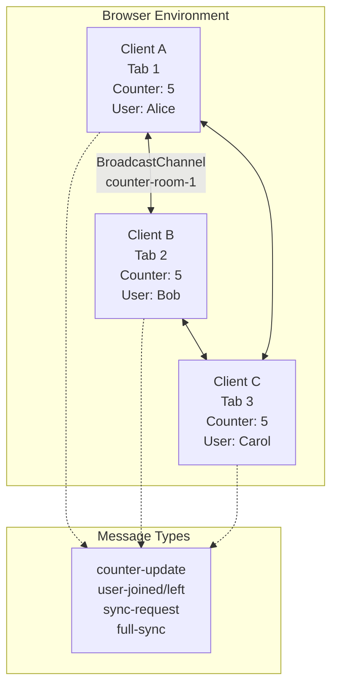

# efe-003: Real-time State Synchronization & Collaborative System

**Status:** [On going]  
**Category:** WebSocket / Real-time Systems  
**Tag:** `Architecture` `State Management` `Collaborative`  
**Last Updated:** สิงหาคม 2026

โปรเจกต์นี้เป็นห้องปฏิบัติการ (Lab) สำหรับศึกษาและทดลองระบบ Synchronize State แบบ Real-time ระหว่างหลาย Clients ผ่านเทคโนโลยี BroadcastChannel API (WebSocket Abstraction) โดยใช้แนวคิดพื้นฐานเดียวกับ Google Docs, Figma และ Notion ในการแชร์สถานะร่วมกัน แก้ปัญหา Conflict และทำ Optimistic UI Updates

## วัตถุประสงค์ (Objectives)

- เข้าใจกลไกการทำงานของ **Publish-Subscribe Pattern** ในระบบ Real-time  
- ฝึกฝนการทำ **Optimistic UI Updates** เพื่อประสบการณ์ผู้ใช้ที่ลื่นไหล  
- จัดการ **State Synchronization** และแก้ปัญหา **Conflict Resolution** เบื้องต้น  
- เรียนรู้รูปแบบการทำ **Event Sourcing** และ **Presence System**  
- ประยุกต์ใช้ BroadcastChannel API ก่อนต่อยอดไป WebSocket จริง (Socket.io)

---

## สถาปัตยกรรมระบบ (System Architecture)

ระบบถูกออกแบบให้ทุก Client มีสถานะเท่าเทียมกัน (Peer-to-Peer ผ่าน BroadcastChannel) ไม่มี Server กลาง แต่ใช้ Browser API ที่จำลองการทำงานของ Pub/Sub System

