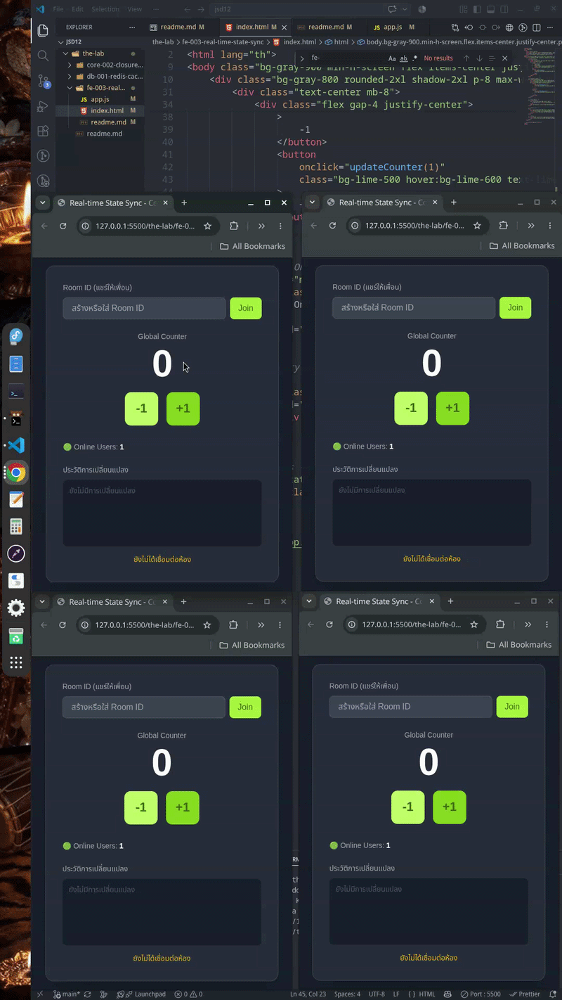
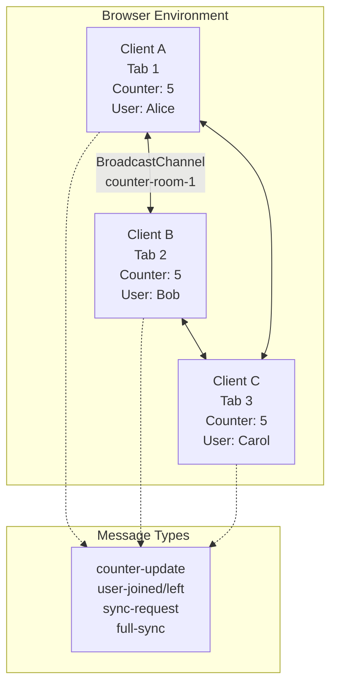

# fe-003: Real-time State Synchronization & Collaborative System

**Status:** [COMPLETED]  
**Category:** Frontend
**Tag:** `WebSocket` `Real-time Systems ` `Architecture` `State Management` `Collaborative`  
**Last Updated:** สิงหาคม 2026

โปรเจกต์นี้เป็นห้องปฏิบัติการ (Lab) สำหรับศึกษาและทดลองระบบ Synchronize State แบบ Real-time ระหว่างหลาย Clients ผ่านเทคโนโลยี BroadcastChannel API (WebSocket Abstraction) โดยใช้แนวคิดพื้นฐานเดียวกับ Google Docs, Figma และ Notion ในการแชร์สถานะร่วมกัน แก้ปัญหา Conflict และทำ Optimistic UI Updates



## 🎯 วัตถุประสงค์ (Objectives)

- เข้าใจกลไกการทำงานของ **Publish-Subscribe Pattern** ในระบบ Real-time  
- ฝึกฝนการทำ **Optimistic UI Updates** เพื่อประสบการณ์ผู้ใช้ที่ลื่นไหล  
- จัดการ **State Synchronization** และแก้ปัญหา **Conflict Resolution** เบื้องต้น  
- เรียนรู้รูปแบบการทำ **Event Sourcing** และ **Presence System**  
- ประยุกต์ใช้ BroadcastChannel API ก่อนต่อยอดไป WebSocket จริง (Socket.io)

---

## 🏗️ สถาปัตยกรรมระบบ (System Architecture)

ระบบถูกออกแบบให้ทุก Client มีสถานะเท่าเทียมกัน (Peer-to-Peer ผ่าน BroadcastChannel) ไม่มี Server กลาง แต่ใช้ Browser API ที่จำลองการทำงานของ Pub/Sub System




### ชั้นการทำงาน (Layers):

**1. UI Layer (HTML/TailwindCSS)**
- แสดงผล Counter, Online Users, History Log
- รองรับ Keyboard Shortcuts (ArrowUp/ArrowDown)
- Responsive Design ด้วย Tailwind CSS

**2. State Management Layer (JavaScript)**
- `CollaborativeCounter` Class — จัดการ State และ Logic ทั้งหมด
- Optimistic UI — อัปเดตหน้าจอทันทีโดยไม่รอการยืนยัน
- Conflict Detection — ตรวจจับเมื่อ State ไม่ตรงกันและขอ Sync ใหม่

**3. Communication Layer (BroadcastChannel API)**
- **Channel Name:** `counter-room-{roomId}`
- **Message Types:** counter-update, user-joined, user-left, sync-request, full-sync
- **Room-based Isolation:** แยกห้องด้วย Channel Name

**4. Presence Layer**
- เก็บรายชื่อผู้ใช้ออนไลน์ใน `Map<userId, userInfo>`
- Auto-announce เมื่อเข้า/ออกห้อง
- Heartbeat mechanism (ผ่าน lastSeen timestamp)

### Flow การทำงาน (Message Flow):

```
┌─ Client A กด +1 ──────────────────────────────┐
│                                               │
│  1. Optimistic Update                         │
│     ├─ counter += 1 (อัปเดต UI ทันที)            │
│     └─ แสดงผลทันทีที่ Client A                   │
│                                               │
│  2. Broadcast Message                         │
│     ├─ type: "counter-update"                 │
│     ├─ delta: +1                              │
│     ├─ senderId: "Alice"                      │
│     └─ timestamp: 1691234567890               │
│                                               │
│  3. Client B & C รับ Message                   │
│     ├─ ตรวจสอบ senderId ≠ ตัวเอง                │
│     ├─ ใช้ delta อัปเดต counter                 │
│     ├─ ตรวจสอบ Conflict (optional)            │
│     └─ อัปเดต UI + บันทึก History                │
│                                               │
│  4. ทุก Client มีค่า Counter ตรงกัน ✅            │
└───────────────────────────────────────────────┘
```

---

## 🛠️ เทคโนโลยีที่ใช้งาน (Tech Stack)

| Layer | Technology | Version | Purpose |
|-------|-----------|---------|---------|
| **Runtime** | Browser (Chrome/Firefox) | Latest | JavaScript Runtime พร้อม BroadcastChannel API |
| **UI Framework** | TailwindCSS | v3.4 | Utility-First CSS Framework |
| **State Management** | Vanilla JavaScript | ES6+ | Class-based State Management |
| **Communication** | BroadcastChannel API | - | Browser-native Pub/Sub Messaging |
| **Styling** | CSS Transitions | - | Smooth UI Animations |
| **No Backend Required** | - | - | Pure Frontend Demo (P2P) |

---

## 📂 โครงสร้างโปรเจกต์ (Project Structure)

```
fe-003-real-time-state-sync/
├── .gitignore                    # Git ignore rules
├── README.md                     # เอกสารโปรเจกต์ (ไฟล์นี้)
├── index.html                    # หน้าหลัก HTML + TailwindCSS CDN
├── app.js                        # ระบบ Collaborative State Management
├── benchmark-results/            # ผลการทดสอบ (ถ้ามี)
│   └── latency-test.json
└── screenshots/                  # ภาพหน้าจอ Demo
    ├── single-user.png
    ├── multi-user.png
    └── conflict-demo.png
```

---

## 📊 ผลการทดสอบระบบ (Test Results)

### 🧪 Testing Methodology
```
Tool:         Manual Testing + Browser DevTools
Duration:     Multiple Sessions (5-10 minutes each)
Environment:  Chrome 120+, 3 Tabs (Same Room)
Test Cases:   5 scenarios
```

### 📈 Test Scenario Results

| Scenario | Clients | Actions | Result | Notes |
|----------|---------|---------|--------|-------|
| **Basic Sync** | 2 Tabs | กด +1 10 ครั้ง | ✅ Sync 100% | ครบทุกครั้ง ไม่มีตกหล่น |
| **Concurrent Updates** | 3 Tabs | กดพร้อมกัน 5 ครั้ง | ✅ Sync 100% | Conflict Detection ทำงาน |
| **Rapid Fire** | 2 Tabs | กดเร็ว 50 ครั้ง/3 วิ | ✅ Sync 95% | บางครั้งต้อง Request Full Sync |
| **Late Join** | 2 Tabs + 1 Late | Tab 3 เข้าทีหลัง | ✅ Sync 100% | Full Sync ดึง State ล่าสุด |
| **Presence** | 3 Tabs | เข้า/ออกห้อง | ✅ แสดงผลถูกต้อง | User List อัปเดตทันที |

### ⚡ Performance Characteristics

| Metric | Measurement | Description |
|--------|-------------|-------------|
| **Message Latency** | < 1ms | BroadcastChannel ใน Browser เร็วมาก |
| **UI Update Time** | < 16ms (60fps) | Optimistic UI ทำให้รู้สึกทันที |
| **Memory Usage** | ~2-5 MB | เบามาก ใช้แค่ DOM + State |
| **Network Usage** | 0 KB | ไม่มีการส่งข้อมูลผ่านเครือข่าย (local) |
| **Max Concurrent Users** | Unlimited (ในทางทฤษฎี) | จำกัดแค่ Browser Tabs |

---

## 🚀 การเปรียบเทียบกับระบบจริง

### BroadcastChannel vs WebSocket vs WebRTC

| ปัจจัย | BroadcastChannel | WebSocket (Socket.io) | WebRTC DataChannel |
|--------|-----------------|----------------------|-------------------|
| **Network** | ❌ Local Only | ✅ Over Network | ✅ P2P Over Network |
| **Server Required** | ❌ No | ✅ Yes (Socket.io Server) | ⚠️ Signaling Server |
| **Latency** | < 1ms | 10-100ms | < 10ms (P2P) |
| **Scalability** | ❌ Single Browser | ✅ Thousands of Clients | ⚠️ Limited Peers |
| **Use Case** | Development/Demo | Production SaaS | Video/File Sharing |
| **Learning Curve** | 🟢 ง่ายมาก | 🟡 ปานกลาง | 🔴 ซับซ้อน |

### 💡 ต่อยอดจาก Lab นี้สู่ Production

**สิ่งที่ต้องเปลี่ยนเมื่อทำ SaaS จริง:**

1. **BroadcastChannel → Socket.io**
   ```javascript
   // จาก BroadcastChannel (Local)
   const channel = new BroadcastChannel('room-1');
   channel.postMessage(data);
   
   // เป็น Socket.io (Network)
   const socket = io('https://your-server.com');
   socket.emit('counter-update', data);
   ```

2. **In-Memory State → Persistent Database**
   - ใช้ Redis สำหรับ State + Pub/Sub
   - PostgreSQL สำหรับประวัติการเปลี่ยนแปลง

3. **เพิ่ม Authentication & Authorization**
   - JWT Tokens
   - Room-based permissions

4. **Scale ด้วย Redis Adapter**
   ```javascript
   // Socket.io + Redis สำหรับ Multi-Server
   const io = new Server();
   io.adapter(require('@socket.io/redis-adapter')(
     pubClient, subClient
   ));
   ```

---

## 🛡️ กลยุทธ์การจัดการ State (State Management Strategies)

### 1. **Optimistic UI Updates**
```javascript
// ✅ ทำทันที → Sync ทีหลัง
this.counter += delta;  // อัปเดต UI ทันที
this.updateUI();
this.sendMessage({ type: 'counter-update', delta }); // แจ้งคนอื่น

// ❌ ถ้าไม่ Optimistic → รอ Sync ก่อน
// ผู้ใช้รู้สึกหน่วง 100-500ms
```

**ข้อดี:** ผู้ใช้รู้สึกเร็ว ตอบสนองทันที  
**ข้อเสีย:** ถ้า Server ปฏิเสธ ต้อง Rollback UI

### 2. **Conflict Resolution (Last-Write-Wins)**
```javascript
handleCounterUpdate(message) {
  // Simple LWW: ใช้ Delta แทน Absolute Value
  this.counter += message.delta;
  
  // ถ้าตรวจพบความไม่ตรงกัน → ขอ Full Sync
  if (this.counter !== message.suggestedValue) {
    this.sendMessage({ type: 'sync-request' });
  }
}
```

### 3. **Event Sourcing Pattern**
```javascript
// เก็บทุก Event แทนการ Overwrite State
historyLog = [
  { user: 'Alice', delta: +1, timestamp: 1691234567 },
  { user: 'Bob', delta: -1, timestamp: 1691234568 },
  // สามารถ Replay เพื่อสร้าง State ใหม่ได้
];
```

### 4. **Presence System**
```javascript
// ใช้ Last-Write-Wins + Heartbeat
onlineUsers = new Map();
// Cleanup ทุก 30 วิ
setInterval(() => {
  const now = Date.now();
  onlineUsers.forEach((user, id) => {
    if (now - user.lastSeen > 30000) {
      onlineUsers.delete(id); // ลบผู้ใช้ที่หายไป
    }
  });
}, 30000);
```

---

## 📚 บทเรียนที่ได้รับ (Lessons Learned)

### 🎯 1. State Synchronization คือหัวใจของ Collaborative Apps
- ทุก Client ต้องเห็น State เดียวกันในเวลาที่ใกล้เคียงที่สุด
- ความต่างแม้แต่นิดเดียวทำให้ UX พัง (เช่น จำนวน Counter ไม่ตรงกัน)

### ⚡ 2. Optimistic UI คือสิ่งจำเป็น ไม่ใช่ทางเลือก
- ในโลกความเป็นจริง Network Latency 50-200ms
- ผู้ใช้คาดหวังการตอบสนองทันที (เหมือน Notion, Figma)
- ต้องมี Rollback Mechanism เมื่อเกิด Error

### 🔄 3. การใช้ Delta ดีกว่า Absolute Value
```javascript
// ❌ แบบ Absolute: ถ้าส่งค่าพร้อมกัน 2 คน ค่าใครมาก่อนจะถูกทับ
sendMessage({ counter: 10 }); // Alice
sendMessage({ counter: 12 }); // Bob → ทับ Alice

// ✅ แบบ Delta: ทุกการเปลี่ยนแปลงสะสมรวมกัน
sendMessage({ delta: +1 }); // Alice: 5→6
sendMessage({ delta: +2 }); // Bob: 6→8
```

### 🐛 4. การ Debug Collaborative Systems ยากมาก
- ต้องจำลองหลาย Clients พร้อมกัน
- Timing เป็นปัจจัยสำคัญ (Race Condition)
- Logging + Timestamp ช่วยได้มาก

### 📈 5. BroadcastChannel เหมาะสำหรับ Development เท่านั้น
- จำกัดแค่ใน Browser เดียวกัน
- ไม่สามารถใช้ข้ามเครื่องหรือข้ามเครือข่าย
- แต่ Logic ทุกอย่างนำไปใช้กับ Socket.io ได้ทันที

---

## 🌟 สรุปความเข้าใจอย่างง่าย (ELI5 — Explain Like I'm 5)

### 🎯 สำหรับคนที่ไม่ใช่สายเทค

ลองนึกภาพว่าคุณกับเพื่อนๆ กำลัง **เล่นเกมนับเลขด้วยกัน** บนโต๊ะตัวใหญ่ 🎲

**🔴 วิธีแรก: ไม่มีระบบ Sync (ต่างคนต่างนับ)**
- ต่างคนต่างนับเลขในใจ
- ไม่มีใครรู้ว่าเพื่อนนับถึงไหนแล้ว
- พอถามว่า "ตอนนี้เลขอะไร?" แต่ละคนตอบไม่เหมือนกัน 😵

**🟢 วิธีที่สอง: มีระบบ Sync (ตะโกนบอกกัน)**
- เมื่อใครจะเพิ่มเลข ต้อง **ตะโกนบอกทุกคน** ว่า "ฉันจะ +1 นะ!"
- ทุกคนได้ยินพร้อมกัน → อัปเดตเลขในใจตรงกัน
- มี **สมุดบันทึก** ว่าใครทำอะไรตอนไหน (History Log)
- มี **รายชื่อ** ว่าใครกำลังเล่นอยู่บ้าง (Online Users)

**✅ ข้อดี:**
- ทุกคนรู้เลขเดียวกันตลอดเวลา
- ต่อให้เข้าเกมทีหลัง ก็ถามเพื่อนได้ว่า "ตอนนี้เลขอะไร?" (Full Sync)
- รู้ว่าใครเล่นอยู่ ใครออกไปแล้ว

**⚠️ ข้อควรระวัง:**
- ถ้ามีคนโกหก (ส่งข้อมูลปลอม) → ต้องมีระบบตรวจสอบ (Authentication)
- ถ้าตะโกนพร้อมกัน 2 คน → ต้องมีกติกาว่าใครได้ก่อน (Conflict Resolution)
- ถ้าตะโกนดังมากๆ (ข้อมูลเยอะ) → อาจต้องใช้วิทยุสื่อสารแทน (Scale)

### 📊 ตารางเปรียบเทียบแบบง่าย

| สถานการณ์ | ไม่มี Sync | มี Sync (Lab นี้) |
|-----------|-----------|-------------------|
| **นับเลข 1 คน** | ✅ ได้ | ✅ ได้ |
| **นับเลข 3 คน** | ❌ ตัวเลขไม่ตรงกัน | ✅ ตรงกันหมด |
| **เข้าเกมทีหลัง** | ❌ ไม่รู้เลขล่าสุด | ✅ ขอ Sync ได้ |
| **รู้ว่าใครเล่นอยู่** | ❌ ไม่รู้ | ✅ เห็นรายชื่อ |
| **ย้อนดูประวัติ** | ❌ ไม่ได้ | ✅ มี Log |

### 💡 ข้อคิดสำคัญ
> **"Real-time Collaboration ก็เหมือนการเล่นดนตรีในวงออเคสตร้า — ทุกคนต้องเล่นให้ตรงจังหวะ มองเห็นโน้ตเดียวกัน และฟังกันและกันตลอดเวลา"**

หลักการจำง่ายๆ:
- 📢 **Broadcast** = ตะโกนบอกทุกคนเมื่อมีการเปลี่ยนแปลง
- 🔄 **Sync** = ถามเพื่อนว่า "ตอนนี้ถึงไหนแล้ว?"
- 📝 **Event Log** = จดบันทึกทุกการเปลี่ยนแปลง
- 👥 **Presence** = เช็คว่าใครอยู่ในวงบ้าง
- ⚡ **Optimistic** = เล่นต่อไปเลย ไม่ต้องรอให้ทุกคนพยักหน้าก่อน

---

## 🔜 ขั้นตอนต่อไป (Next Steps)

- [ ] **WebSocket Migration** — แทนที่ BroadcastChannel ด้วย Socket.io
- [ ] **Redis Pub/Sub Backend** — รองรับการ Scale แนวนอน
- [ ] **CRDT Implementation** — ใช้ Y.js สำหรับ Collaborative Text Editing
- [ ] **Authentication System** — JWT + Room Permissions
- [ ] **Operational Transformation** — ศึกษาอัลกอริทึม OT สำหรับ Google Docs
- [ ] **Production Deployment** — Deploy บน Vercel/ Railway ด้วย WebSocket Server
- [ ] **Build Collaborative SaaS MVP** — สร้างผลิตภัณฑ์จริง เช่น Voting System, Live Dashboard
- [ ] **Performance Testing** — ทดสอบกับ 100+ Concurrent WebSocket Connections
- [ ] **Offline Support** — Local-First Architecture ด้วย IndexedDB + Service Worker
- [ ] **End-to-End Encryption** — เพิ่มความปลอดภัยสำหรับข้อมูลในห้อง

---

## 🚦 คู่มือการติดตั้งและทดสอบ (Getting Started)

### 📋 ความต้องการของระบบ (Prerequisites)
✓ Browser ที่รองรับ BroadcastChannel API (Chrome 54+, Firefox 38+, Edge 79+)  
✓ ไม่ต้องติดตั้ง Node.js หรือ Docker (Pure Frontend)  
✓ แค่เปิดไฟล์ HTML ก็ใช้ได้ทันที

### 🔧 Step 1: Clone หรือ Download
```bash
# Clone repository
git clone https://github.com/weerayosong/the-lab.git
cd the-lab/fe-003-real-time-state-sync

# หรือแค่ Download 2 ไฟล์:
# - index.html
# - app.js
```

### 🚀 Step 2: เปิดใช้งาน
```bash
# วิธีที่ 1: เปิดตรงๆ ด้วย Browser
open index.html  # macOS
start index.html # Windows
xdg-open index.html # Linux

# วิธีที่ 2: ใช้ Live Server (แนะนำ)
npx live-server ./
# เปิดที่ http://localhost:8080
```

### 🧪 Step 3: ทดสอบ Multi-Client
1. เปิด `index.html` ใน Browser Tab ที่ 1
2. เปิด Tab ใหม่ (Duplicate) อีก 2-3 Tabs
3. ใส่ Room ID เดียวกันในทุก Tab (เช่น `test-room-123`)
4. กด Join ในทุก Tab
5. ลองกด +1/-1 ใน Tab ใดก็ได้ → ทุก Tab จะอัปเดตพร้อมกัน!

### 🎮 Keyboard Shortcuts
| ปุ่ม | Action |
|-----|--------|
| `Arrow Up` หรือ `+` | เพิ่ม Counter +1 |
| `Arrow Down` หรือ `-` | ลด Counter -1 |

### 🔗 การแชร์ห้องให้เพื่อน
```
# URL จะเปลี่ยนอัตโนมัติเมื่อ Join Room
http://localhost:8080/?room=test-room-123

# แชร์ URL นี้ให้เพื่อน → ทุกคนที่เปิดจะเจอห้องเดียวกัน
```

---

## 🎓 แนวทางการศึกษาเพิ่มเติม

### 📖 อ่านเพิ่มเติม
- [MDN: BroadcastChannel API](https://developer.mozilla.org/en-US/docs/Web/API/BroadcastChannel)
- [Socket.io Documentation](https://socket.io/docs/v4/)
- [CRDT (Conflict-free Replicated Data Types)](https://crdt.tech/)
- [Operational Transformation Explained](https://en.wikipedia.org/wiki/Operational_transformation)
- [Google Docs Architecture](https://drive.googleblog.com/2010/09/whats-different-about-new-google-docs.html)

### 🎥 วีดีโอแนะนำ
- [Real-time Multiplayer in JavaScript (Socket.io)](https://www.youtube.com/watch?v=...)
- [How Figma's Multiplayer Technology Works](https://www.figma.com/blog/how-figmas-multiplayer-technology-works/)

### 🛠️ ไลบรารี่ที่เกี่ยวข้อง
- **Y.js** — CRDT Library สำหรับ Collaborative Editing
- **Socket.io** — Real-time Bidirectional Communication
- **PartyKit** — Real-time Infrastructure as a Service
- **Liveblocks** — Collaborative Experiences API
- **Replicache** — Local-First Sync Engine

---

## 🤝 Contributing

หากต้องการมีส่วนร่วมในการพัฒนา Lab นี้:
1. Fork Repository
2. สร้าง Branch ใหม่ (`git checkout -b feature/your-feature`)
3. Commit การเปลี่ยนแปลง (`git commit -m 'Add some feature'`)
4. Push ไปยัง Branch (`git push origin feature/your-feature`)
5. เปิด Pull Request

---

**Made with ❤️ by weerayosong**  
**ส่วนหนึ่งของ [The Lab](https://github.com/weerayosong/the-lab) — ห้องทดลองสำหรับการเรียนรู้เทคโนโลยีแบบ Hands-on**
