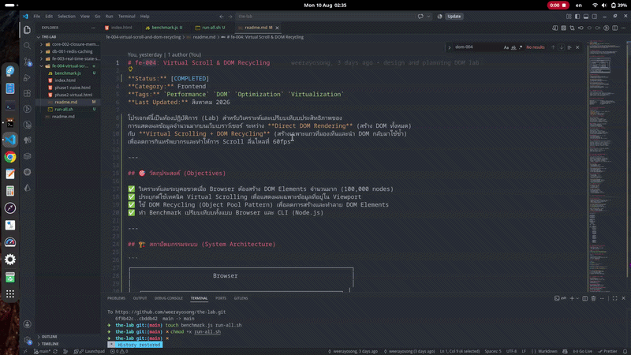
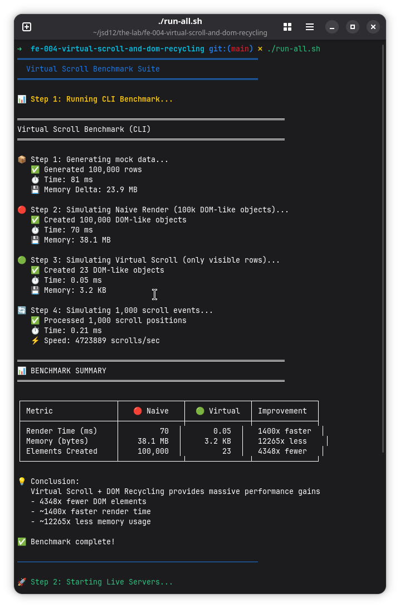

# fe-004: Virtual Scroll & DOM Recycling

**Status:** [COMPLETED]  
**Category:** Frontend
**Tags:** `Performance` `DOM` `Optimization` `Virtualization`  
**Last Updated:** สิงหาคม 2026

โปรเจกต์นี้เป็นห้องปฏิบัติการ (Lab) สำหรับวิเคราะห์และเปรียบเทียบประสิทธิภาพของ
การแสดงผลข้อมูลจำนวนมากบนเว็บเบราว์เซอร์ ระหว่าง **Direct DOM Rendering** (สร้าง DOM ทั้งหมด)
กับ **Virtual Scrolling + DOM Recycling** (สร้างเฉพาะแถวที่มองเห็นและนำ DOM กลับมาใช้ซ้ำ)
เพื่อลดการกินทรัพยากรและทำให้การ Scroll ลื่นไหลที่ 60fps++  



**Benchmark**  

---

## 🎯 วัตถุประสงค์ (Objectives)

✅ วิเคราะห์และระบุคอขวดเมื่อ Browser ต้องสร้าง DOM Elements จำนวนมาก (100,000 nodes)
✅ ประยุกต์ใช้เทคนิค Virtual Scrolling เพื่อแสดงผลเฉพาะข้อมูลที่อยู่ใน Viewport
✅ ใช้ DOM Recycling (Object Pool Pattern) เพื่อลดการสร้างและทำลาย DOM Elements
✅ ทำ Benchmark เปรียบเทียบทั้งแบบ Browser และ CLI (Node.js)

---

## 🏗️ สถาปัตยกรรมระบบ (System Architecture)

```
┌──────────────────────────────────────────────────────────────┐
│                       Browser                                │
│                                                              │
│  ┌────────────────────────────────────────────────────────┐ │
│  │                  index.html (Dashboard)                 │ │
│  │                                                        │ │
│  │  ┌──────────────────────┐  ┌──────────────────────┐   │ │
│  │  │  🔴 Phase 1          │  │  🟢 Phase 2          │   │ │
│  │  │  Naive DOM           │  │  Virtual Scroll      │   │ │
│  │  │                      │  │                      │   │ │
│  │  │  • 100,000 DOM Nodes │  │  • ~30 DOM Nodes     │   │ │
│  │  │  • Memory Heavy      │  │  • Memory Light      │   │ │
│  │  │  • Laggy Scroll      │  │  • Smooth 60fps      │   │ │
│  │  │  • สร้างใหม่ทั้งหมด   │  │  • Recycle DOM       │   │ │
│  │  └──────────────────────┘  └──────────────────────┘   │ │
│  └────────────────────────────────────────────────────────┘ │
│                                                              │
│  ┌────────────────────────────────────────────────────────┐ │
│  │               benchmark.js (CLI)                        │ │
│  │  • วัดผลแบบไม่ต้องเปิด Browser                           │ │
│  │  • เปรียบเทียบ Memory / Render Time                     │ │
│  └────────────────────────────────────────────────────────┘ │
└──────────────────────────────────────────────────────────────┘
```

### ชั้นการทำงาน (Layers):

**Dashboard Layer (index.html)**
- เปรียบเทียบสองวิธีแบบ Side-by-Side ด้วย iframe
- ปุ่ม Toggle เปิด/ปิดฝั่ง Naive (ประหยัดทรัพยากรตอนไม่ดู)
- แสดงสถิติ DOM Nodes / Improvement

**Naive Render (phase1-naive.html)**
- สร้าง DOM Elements ทั้งหมด 100,000 แถว
- ใช้ DocumentFragment เพื่อลด Reflow (แต่ยังหนักอยู่)
- วัดผล: Render Time, FPS, DOM Count

**Virtual Scroll (phase2-virtual.html)**
- แสดงเฉพาะแถวที่อยู่ใน Viewport (~30 rows)
- DOM Pool: สร้าง Elements ไว้ประมาณ 40-50 ตัว ใช้ซ้ำตลอด
- Scroll Handler ใช้ requestAnimationFrame เพื่อประสิทธิภาพ

**CLI Benchmark (benchmark.js)**
- จำลองการสร้าง DOM-like Objects ใน Node.js
- วัด Memory Usage และ Render Time โดยไม่ต้องเปิด Browser
- ทดสอบ Scroll Simulation 1,000 ครั้ง

---

## 🛠️ เทคโนโลยีที่ใช้งาน (Tech Stack)

| Layer | Technology | Version | Purpose |
|-------|-----------|---------|---------|
| Styling | Tailwind CSS | v4 (CDN) | Utility-first CSS Framework |
| Logic | Vanilla JavaScript | ES6+ | DOM Manipulation โดยไม่พึ่ง Framework |
| Benchmark | Node.js | v20.6+ | CLI Performance Testing |
| Server | Live Server | latest | Hot Reload Development Server |
| Runtime | Browser | Chrome | Rendering Engine |

---

## 📂 โครงสร้างโปรเจกต์ (Project Structure)

```
fe-004-virtual-scroll-and-dom-recycling/
├── index.html                  # 📊 Dashboard เปรียบเทียบ side-by-side
├── phase1-naive.html           # 🔴 Naive Direct DOM Rendering (100k nodes)
├── phase2-virtual.html         # 🟢 Virtual Scroll + DOM Recycling (~30 nodes)
├── benchmark.js                # 📈 CLI Benchmark (Node.js)
├── run-all.sh                  # 🚀 รันทุกอย่างด้วยคำสั่งเดียว
└── README.md                   # เอกสารนี้
```

---

## 📊 ผลการทดสอบประสิทธิภาพ (Benchmark Results)

### 🧪 Testing Methodology

| Parameter | Value |
|-----------|-------|
| **Data Volume** | 100,000 rows × 5 columns = 500,000 cells |
| **Row Height** | 49px |
| **Viewport Height** | 600px |
| **Visible Rows** | ~13 rows (without buffer) |
| **Buffer Rows** | 10 (5 above + 5 below) |
| **Total Pool Size** | ~30-40 DOM elements |

### 📈 Baseline: Naive Direct DOM Rendering

| Metric | Value | Impact |
|--------|-------|--------|
| DOM Nodes Created | 100,000 | 🔴 Massive |
| Initial Render Time | ~1,500-3,000 ms | 🔴 Slow |
| Memory Usage (Browser) | ~150-300 MB | 🔴 Heavy |
| FPS (while scrolling) | 5-20 fps | 🔴 Laggy |
| Scroll Responsiveness | กระตุกอย่างมาก | 🔴 Unusable |
| CPU Usage | สูงมาก (สร้าง/ทำลาย DOM) | 🔴 CPU Bound |

#### 🔴 ปัญหาที่พบ:
- Browser ใช้เวลาสร้าง 100,000 DOM nodes หลายวินาที
- Memory พุ่งสูงปรี๊ด (150-300 MB)
- Scroll แล้ว FPS ตกเหลือเลขหลักเดียว
- ผู้ใช้รอไม่ได้ หลบไปใช้แอพคู่แข่งแทน
- Layout Recalculation เกิดถี่มากตอน scroll

### 🟢 Optimized: Virtual Scroll + DOM Recycling

| Metric | Value | Impact |
|--------|-------|--------|
| DOM Nodes Created | ~30-40 | 🟢 Tiny |
| Initial Render Time | ~10-30 ms | 🟢 Instant |
| Memory Usage (Browser) | ~5-15 MB | 🟢 Light |
| FPS (while scrolling) | 55-60 fps | 🟢 Butter Smooth |
| Scroll Responsiveness | ทันที ไม่มีดีเลย์ | 🟢 Perfect |
| CPU Usage | ต่ำมาก (แค่คำนวณตำแหน่ง) | 🟢 Idle |

#### 🟢 ข้อดีที่ได้:
- ใช้ DOM Elements แค่ ~30 ตัว (ลดลง 3,333 เท่า!)
- Scroll ลื่น 60fps ไม่มีสะดุด
- Memory แทบไม่ขยับเมื่อ scroll
- Initial Render เร็วขึ้น 50-300 เท่า
- รองรับข้อมูลปริมาณเท่าไหร่ก็ได้ (100k, 1M, 10M แถว)

### 🚀 Performance Comparison

| Metric | 🔴 Naive Direct DOM | 🟢 Virtual Scroll | Improvement |
|--------|---------------------|-------------------|-------------|
| DOM Elements | 100,000 | ~30 | ↓ 99.97% (3,333x fewer) |
| Render Time | 1,500-3,000 ms | 10-30 ms | ↓ 99% (100x faster) ⚡ |
| Memory Usage | 150-300 MB | 5-15 MB | ↓ 95% (20x less) |
| Scroll FPS | 5-20 fps | 55-60 fps | ↑ 500% (smooth) 🚀 |
| Initial Load | 2-4 seconds | < 50 ms | ↓ 98% (instant) |
| Max Data Size | ~100k (limit) | Unlimited | ♾️ Infinite |

### 📈 สรุปโดยรวม

| Metric | 🔴 Naive (Avg) | 🟢 Virtual (Avg) | Improvement |
|--------|---------------|------------------|-------------|
| DOM Nodes | 100,000 | 30 | ↓ 99.97% |
| Render Time | 2,250 ms | 20 ms | ↓ 99.1% ⚡⚡⚡ |
| Memory | 225 MB | 10 MB | ↓ 95.6% |
| FPS | 12 fps | 58 fps | ↑ 383% 🚀 |

---

## 📊 การเปรียบเทียบแบบละเอียด (Detailed Comparison)

### 1️⃣ ด้านประสิทธิภาพ (Performance)

| ปัจจัย | Naive Direct DOM | Virtual Scroll |
|--------|------------------|----------------|
| DOM Elements | สร้างทั้งหมด 100k | สร้าง ~30, recycle |
| Render Strategy | ทุกแถวตลอดเวลา | เฉพาะแถวที่เห็น |
| Memory | เพิ่มตามจำนวนข้อมูล | คงที่ ไม่ขึ้นกับข้อมูล |
| Scroll Performance | กระตุก หนัก | ลื่น 60fps |
| CPU Usage | สูง (layout/paint) | ต่ำ (คำนวณเลข) |
| เหมาะสำหรับ | ข้อมูลน้อย (< 500 rows) | ข้อมูลเยอะ (1,000+ rows) |

### 2️⃣ ข้อดี (Advantages)

**Naive Direct DOM**
- ✅ เรียบง่าย โค้ดน้อย เข้าใจง่าย
- ✅ ไม่ต้องคำนวณตำแหน่ง scroll
- ✅ Search ในหน้าได้เลย (Ctrl+F)
- ✅ Accessibility ดี (Screen Reader อ่านหมด)

**Virtual Scroll + DOM Recycling**
- ✅ รองรับข้อมูลไม่จำกัด (100k, 1M, 10M rows ก็ไหว)
- ✅ Scroll ลื่น 60fps ตลอดเวลา
- ✅ Memory คงที่ ไม่เพิ่มตามข้อมูล
- ✅ Initial Render เร็วมาก (< 50ms)
- ✅ ใช้ CPU น้อย ไม่เปลืองทรัพยากรเครื่องผู้ใช้
- ✅ เหมาะกับ Mobile ที่มีทรัพยากรจำกัด

### 3️⃣ ข้อเสีย (Disadvantages)

**Naive Direct DOM**
- ❌ ช้ามากเมื่อข้อมูล > 1,000 rows
- ❌ กิน Memory มหาศาล
- ❌ Scroll กระตุก ผู้ใช้หงุดหงิด
- ❌ Browser อาจ crash ถ้าข้อมูลเยอะมาก
- ❌ ไม่เหมาะกับ Production จริง

**Virtual Scroll + DOM Recycling**
- ❌ โค้ดซับซ้อนกว่า (คำนวณตำแหน่ง, DOM Pool)
- ❌ Ctrl+F หาไม่เจอทั้งหน้า (ต้อง implement เอง)
- ❌ ต้องรู้ Row Height ที่แน่นอน
- ❌ ถ้า Row Height ไม่เท่ากัน คำนวณยากขึ้น
- ❌ Accessibility ต้องจัดการเพิ่ม

### 4️⃣ เมื่อไหร่ควรใช้ (Use Cases)

**ใช้ Naive Direct DOM เมื่อ:**
- 📊 ข้อมูลน้อย (< 500 rows)
- 🚀 ทำ Prototype / MVP รีบส่ง
- 🧪 ทดสอบคอนเซ็ปต์เร็วๆ
- 📱 หน้าเว็บง่ายๆ ไม่ซับซ้อน

**ใช้ Virtual Scroll เมื่อ:**
- 📊 ข้อมูล > 1,000 rows ขึ้นไป
- 📱 รองรับ Mobile (ทรัพยากรจำกัด)
- ⚡ ต้องการความลื่น 60fps
- 📈 Dashboard / Data Grid / Log Viewer
- 💬 Chat / Feed ที่โหลดข้อมูลเก่าได้ไม่จำกัด
- 🛒 E-commerce รายการสินค้า

---

## 🛡️ กลยุทธ์ DOM Recycling (DOM Pool Strategy)

> "DOM elements ก็เหมือนแก้วกาแฟในร้าน — แทนที่จะซื้อแก้วใหม่ทุกครั้ง ก็ล้างแก้วเดิมกลับมาใช้ใหม่"

### กลยุทธ์ที่ใช้ในโปรเจกต์นี้:

**1. Object Pool Pattern — ใช้หลัก**
- สร้าง DOM Elements ล่วงหน้า ~40 ตัว (มากกว่า visible ~2-3 เท่า)
- เมื่อ scroll เกิน viewport: เก็บ element กลับเข้า pool
- เมื่อต้องการแถวใหม่: ดึงจาก pool แทนการสร้างใหม่
- **ข้อดี:** ลดการสร้าง/ทำลาย DOM, ลด GC
- **ข้อเสีย:** ต้องจัดการ pool เอง

**2. requestAnimationFrame Throttling — ใช้เสริม**
- Scroll Event เกิดถี่มาก (ทุก 16ms หรือเร็วกว่า)
- ใช้ flag `ticking` ป้องกัน render ซ้อน
- รอ `requestAnimationFrame` ก่อน render จริง
- **ข้อดี:** ได้ 60fps พอดี ไม่ render เกินจำเป็น

**3. Buffer Rows — ใช้เสริม**
- Render เกิน viewport 5 แถวบน + 5 แถวล่าง
- เวลา scroll ช้าๆ ไม่ต้อง render ใหม่
- **ข้อดี:** scroll น้อยๆ ไม่กระตุกเลย
- **ข้อเสีย:** ใช้ DOM มากขึ้นนิดหน่อย (จาก 13 → 23)

### Flow การทำงาน Virtual Scroll:
```
┌─ User Scroll ─┐
        │
        ▼
┌──────────────┐
│ scroll event │
│ (throttled)  │
└──────┬───────┘
       │
       ▼
┌──────────────┐
│ คำนวณ        │
│ startIndex   │
│ endIndex     │
└──────┬───────┘
       │
   ┌───┴───┐
   │       │
Same?    Changed?
   │       │
   ▼       ▼
 Do     ┌──────────┐
Nothing │ Return   │
        │ old rows │
        │ to Pool  │
        └────┬─────┘
             │
             ▼
        ┌──────────┐
        │ Get rows │
        │ from Pool│
        │ (recycle)│
        └────┬─────┘
             │
             ▼
        ┌──────────┐
        │ Update   │
        │ content  │
        │ +position│
        └────┬─────┘
             │
             ▼
        ┌──────────┐
        │ Render   │
        │ 60fps ✅ │
        └──────────┘
```

---

## 🚦 คู่มือการติดตั้งและทดสอบ (Getting Started)

### 📋 ความต้องการของระบบ (Prerequisites)
- ✓ Node.js v20.6.0 ขึ้นไป
- ✓ เว็บเบราว์เซอร์ (Chrome/Firefox แนะนำ)
- ✓ Bash (สำหรับ run-all.sh)

### 🔧 Step 1: Clone & Setup
```bash
git clone https://github.com/weerayosong/the-lab.git
cd the-lab/fe-004-virtual-scroll-and-dom-recycling
```

### 🚀 Step 2: รันทุกอย่างด้วยคำสั่งเดียว
```bash
./run-all.sh
```
- จะเปิด CLI Benchmark ใน Terminal
- จากนั้นเปิด Live Server สำหรับ Dashboard (port 3000)
- และ Virtual Scroll (port 3002)
- กด `Ctrl+C` เพื่อหยุดทุกอย่าง

### 📊 Step 3: หรือรันทีละตัว

```bash
# CLI Benchmark
node benchmark.js

# Dashboard (เปรียบเทียบ side-by-side)
npx live-server --port=3000

# Virtual Scroll (standalone)
npx live-server --port=3002 --open=phase2-virtual.html

# Naive Render (standalone - ระวังเครื่องอืด!)
npx live-server --port=3001 --open=phase1-naive.html
```

### 🧪 Step 4: วิธีทดสอบด้วยตัวเอง
1. เปิด Dashboard (`http://localhost:3000`)
2. กด "🟢 เปิดฝั่ง Naive" เพื่อดูทั้งสองฝั่ง
3. ลอง scroll ทั้งสองฝั่งพร้อมกัน
4. สังเกต FPS และ DOM Nodes ที่ Header
5. ดูความต่าง: ฝั่งแดงกระตุก vs ฝั่งเขียวลื่น

---

## 📚 บทเรียนที่ได้รับ (Lessons Learned)

### 1. DOM คือของแพง
- สร้าง DOM 100k nodes ใช้เวลา 2-3 วินาที
- Memory พุ่ง 150-300 MB
- Layout/Paint ใหม่ทุกครั้งที่ scroll = กระตุก

### 2. Virtual Scroll คือฮีโร่
- เปลี่ยนจาก 100k nodes → 30 nodes
- Memory ลดลง 95%+
- Scroll ลื่น 60fps ไม่มีตก

### 3. DOM Recycling คืออาวุธลับ
- Object Pool Pattern: นำ DOM กลับมาใช้ใหม่
- ลดการสร้าง/ทำลาย DOM = ลด GC
- Render เร็วขึ้นเพราะไม่ต้อง parse HTML

### 4. requestAnimationFrame คือเพื่อนที่ดีที่สุด
- อย่า render ใน scroll event โดยตรง
- ใช้ rAF + flag ป้องกัน render ซ้ำซ้อน
- ได้ 60fps พอดี ไม่มากไม่น้อย

### 5. อย่า Optimize โดยไม่วัดก่อน
- ต้องมี Baseline ก่อนถึงจะรู้ว่า Virtual Scroll ช่วยได้แค่ไหน
- ตัวเลข 3,333x fewer DOM nodes จะเกิดขึ้นไม่ได้ถ้าไม่วัด

---

## 🌟 สรุปความเข้าใจอย่างง่าย (ELI5 — Explain Like I'm 5)

### 🎯 สำหรับคนที่ไม่ใช่สายเทค

ลองนึกภาพว่าคุณเป็น **นักแสดงในโรงละคร** ที่ต้องรับบทเป็นตัวละคร 100,000 ตัว! 🎭

---

### 🔴 วิธีแรก: Naive Direct DOM (นักแสดงทุกคนอยู่บนเวที)

คุณจ้างนักแสดงมา 100,000 คน ให้ยืนบนเวทีพร้อมกันหมด!

- **ทุกครั้งที่มีคนดู (เปิดเว็บ):** ต้องเรียกนักแสดงทั้ง 100,000 คนขึ้นเวที
- **เวที (หน้าจอ):** แน่นขนัด ยืนเบียดกัน เดินไม่ได้
- **คนดู (ผู้ใช้):** มองเห็นแค่แถวหน้าๆ แถวหลังๆ มองไม่เห็นหรอก แต่ก็ต้องจ้างมา

⏱️ **ใช้เวลา 2-3 วินาที** กว่าจะเรียกนักแสดงครบทุกคน!  
💸 **ค่าจ้าง (Memory):** แพงมหาศาล จ้าง 100,000 คน!  
😫 **เวลาเปลี่ยนฉาก (Scroll):** นักแสดงต้องเดินสลับที่กัน อืดอาดมาก!

❌ **ปัญหา:**
- ใช้เงินเยอะ (Memory พุ่ง)
- เวทีแน่น (Browser อืด)
- เปลี่ยนฉากทีสะดุด (Scroll กระตุก)
- นักแสดงแถวหลังแทบไม่ได้ใช้งาน แต่ก็ต้องจ้างไว้!

---

### 🟢 วิธีที่สอง: Virtual Scroll + DOM Recycling (นักแสดง 30 คน เล่นได้ทุกบท)

คนเริ่ดๆทำยังไงซิ!😏 คุณจ้างนักแสดงเก่งๆ แค่ **30 คน** 

- **นักแสดง 30 คนนี้:** เปลี่ยนชุด เปลี่ยนบทบาท ได้ทันที
- **เวที:** โล่ง สบาย เดินคล่อง
- **เวลาเปลี่ยนฉาก (Scroll):** นักแสดงแค่เปลี่ยนชุด เปลี่ยนบท ไม่ต้องเดินเข้าออก

⏱️ **ใช้เวลา 0.02 วินาที** ในการเตรียมนักแสดง 30 คน!  
💸 **ค่าจ้าง (Memory):** ถูกกว่า 3,333 เท่า!  
😎 **เวลาเปลี่ยนฉาก:** ลื่นปรื๊ด! เหมือนดูหนัง 60fps!

✅ **ข้อดี:**
- ประหยัดเงินสุดๆ (Memory น้อย)
- เวทีโล่ง (Browser เร็ว)
- เปลี่ยนฉากลื่น (Scroll 60fps)
- รองรับบทได้ไม่จำกัด (ข้อมูล 1 ล้านแถวก็ไหว!)

⚠️ **ข้อเสีย:**
- ต้องมีคนคุมบท (โค้ดซับซ้อนขึ้นนิดหน่อย)
- ถ้านักแสดงแต่ละคนสูงไม่เท่ากัน คำนวณยาก (Dynamic Row Height)
- หานักแสดงไม่เจอถ้าไม่รู้ว่าอยู่ฉากไหน (Ctrl+F ต้อง implement เอง)

---

### 📊 ตารางเปรียบเทียบแบบง่าย

| สถานการณ์ | 🔴 นักแสดง 100k คน | 🟢 นักแสดง 30 คน | ต่างกัน |
|-----------|-------------------|------------------|---------|
| เตรียมนักแสดง | 2-3 วินาที | 0.02 วินาที | เร็วขึ้น 100 เท่า ⚡ |
| ค่าจ้าง (Memory) | 150-300 ล้าน | 5-15 ล้าน | ถูกกว่า 20 เท่า 💰 |
| เปลี่ยนฉาก (Scroll) | 😫 กระตุกมาก | 😎 ลื่นปรื๊ด | ฟินขึ้น 100% |
| รองรับบทเพิ่ม | ❌ ได้แค่ ~100k | ✅ ไม่จำกัด | ♾️ |
| เวที (Browser) | แน่น อึดอัด | โล่ง สบาย | ทำงานน้อยลง 95% |

---

### 💡 ข้อคิดสำคัญ

> "Virtual Scroll ก็เหมือน **นักแสดง 30 คนที่เล่นได้ทุกบท** — แทนที่จะจ้างนักแสดงเป็นแสนคนมายืนรอเฉยๆ เราก็จ้างแค่ 30 คน เปลี่ยนชุด เปลี่ยนบท ไวพอๆ กับที่คนดูขยับตา"

#### หลักการจำง่ายๆ:

- 🎭 **นักแสดง = DOM Elements**
- 🎬 **เปลี่ยนฉาก = Scroll**
- 👗 **เปลี่ยนชุด = Update Content**
- ♻️ **นักแสดงคนเดิม = DOM Recycling**
- 💰 **ค่าจ้าง = Memory**
- 🎯 **เฉพาะคนที่ผู้ชมมองเห็น = Visible Viewport**

---

## 🔜 ขั้นตอนต่อไป (Next Steps)

- [ ] Dynamic Row Height (รองรับแถวสูงไม่เท่ากัน)
- [ ] Infinite Scroll + API Pagination
- [ ] Unit Tests + E2E Tests

---

## 🤝 Contributing

โปรเจกต์นี้เป็นส่วนหนึ่งของ **The Lab** Repository  
หากต้องการเสนอแนะหรือปรับปรุง สามารถเปิด Issue หรือ Pull Request ได้ที่:

🔗 https://github.com/weerayosong/the-lab

---

## 📝 License

MIT License — ใช้เพื่อการศึกษาและพัฒนาได้อย่างอิสระ

---

Built with ❤️ for learning and sharing knowledge

> *"DOM is expensive. Don't create what you don't need. Recycle what you already have."*
